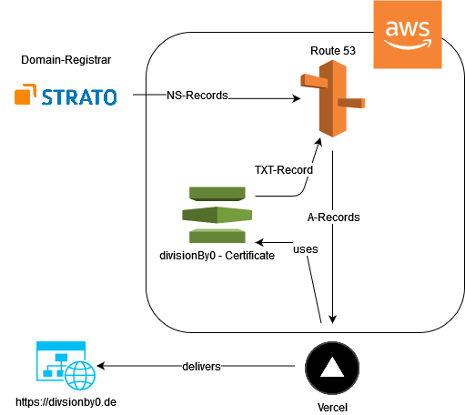

# Infrastructure of DivisionBy0-Blog

## Description
The following project contains the basic infrastructure of the [divisionby0.de](https://divisionby0.de) blog.

The blog is based on the [Tailwind Nextjs Starter Blog](https://github.com/timlrx/tailwind-nextjs-starter-blog) project and is delivered via [Vercel](https://vercel.com).

This project contains the basic AWS infrastructure as [Terraform](https://www.terraform.io/) scripts.



As you can see the new infrastructure has less AWS components using Vercel for hosting the blog instead of AWS Cloudfront mentioned in the [blog infrastructure with IaC](https://divisionby0.de/posts/blog-iac-mit-terraform) article.

## How to use
### Prerequisites
If you want to use this scripts you should:
* Have an AWS Acccount
* Install and configure the [AWS-CLI](https://aws.amazon.com/de/cli/)
* Install [Terraform](https://www.terraform.io/downloads.html)
* Update variables in this project to match your domain and bucket names

### Deploying infrastructure
First initialize the Terraform working directory with the following command:
```
terraform init
```

Afterwards plan and apply your changes using:
```
terraform apply
```

When applying the infrastructure terraform will create a hosted zone in AWS Route53. Make sure the name servers of your domain points to this hosted zone, otherwise the certificate validation won't succeed.

See [docs](https://www.terraform.io/docs/commands/index.html) for further details regarding the Terraform CLI.
